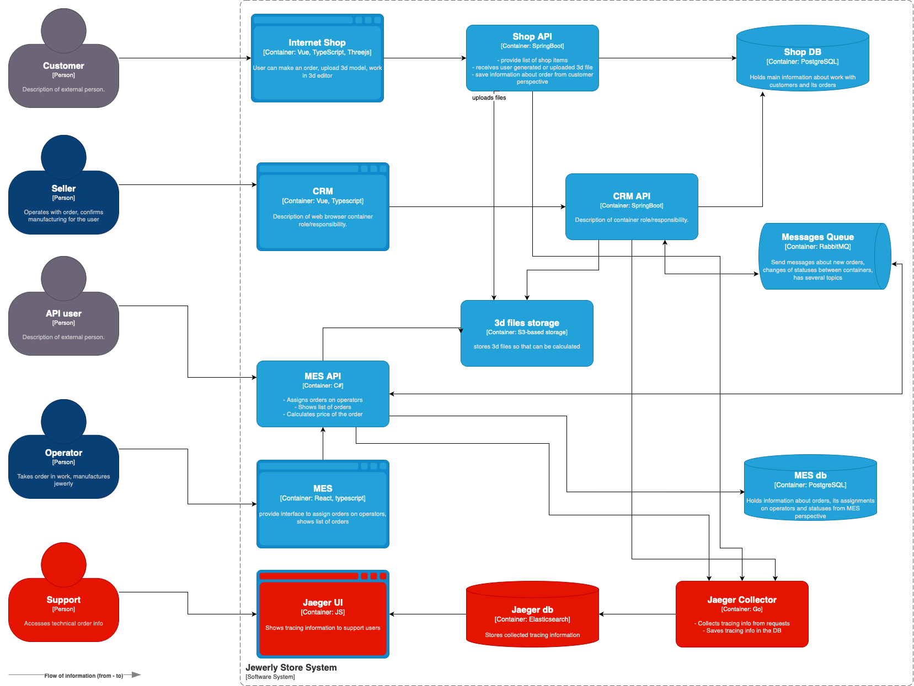

# Архитектурное решение по трейсингу

## Мотивация

Внедрение трассировки запросов позволит компании решить ряд задач:

1. Трассировка запросов позволит понимать, на каком этапе "застрял" заказ, что позволит поддержке лучше решать проблемы клиентов с заказами и держать клиентов в курсе ситуации
2. Понимание того, какие компоненты ИТ-систем вызывают максимальные проблемы, ускорит исправление проблем и высвободит больше ресурсов на внедрение новых фич
3. В случае возникновения конфликтных ситуаций с заказами, анализ пути запроса позволит понять, когда и в связи с какой логикой изменялся статус заказа. Это потенциально позволит компании избежать лишних финансовых потерь

## Предлагаемое решение

Предлагается реализовать трейсинг с помощью технологии OpenTelemetry. В качестве реализации лучше всего выбрать Jaeger, как наиболее хорошо описанный вариант с поддержкой множества языков программирования. Под капотом предлагается использовать Elasticsearch как рекомендуемое решение для хранения трейсов, так как она обеспечивает поиск по трейсам, а Cassandra может потребоваться только в случае куда более высоких нагрузок, чем те, что пока есть или потенциально возможны.

## Компромиссы

При реализации трассировки требуется пойти на ряд допущений:

* Трассировка запросов в БД и хранилище S3 на уровне вызова из сервисов обязательна, но вот трассировка самих БД избыточна. Реляционные базы, как и S3-хранилище, умеют достаточно подробно описывать запросы (например, с использованием `EXPLAIN`, pg_stat_activity и т.д.)
* Аналогично не требуется трассировка запросов внутри RabbitMQ. Передавать данные для трассировки через очереди и мониторить точки produce/consume в сервисах, требуется, но внутренние операции в RabbitMQ трейсить дорого, и бессмысленно, т.к. достаточные данные предоставляет мониторинг очередей
* Трейсинг в MES, как проприетарной системе (если только она не поддерживает интеграцию с OpenTelemetry), настолько труден, что можно считать его невозможным. Опять-таки, максимум возможна трассировка до вызовов этой системы из наших сервисов

## Аспекты безопасности

При внедрении трассировки обязательно будет провести ряд работ по разграничению доступа к трейсам:

1. Для доступа к Jaeger UI требуется иметь актуальную учетную запись с ролью "Поддержка". Для сотрудников, занятых на конкретных проектах, требуется обеспечить доступ только к namespace конкретного проекта
2. Требуется обязательно исключить попадание в трейсы конфиденциальных, персональных данных, паролей, токенов и т.д. Для этого нужно ввести либо маскировку, либо очистку чувствительных данных
3. Доступ к агентам и UI Jaeger желательно организовать только из внутренней сети компании, через VPN. В противном случае возможно получение несанкционированного доступа к трейсам
4. Транспорт для трейсов должен быть безопасным, использовать TLS, а также желательно хранить трейсы в шифрованном виде (если это позволит объем трейсов и скорость поиска по ним - требуется провести замеры)
5. Запретить полностью передачу трейсов внешним партнерам (например, компании-разработчику MES). Передавать только согласованные со специалистом по ИБ выдержки в случае необходимости