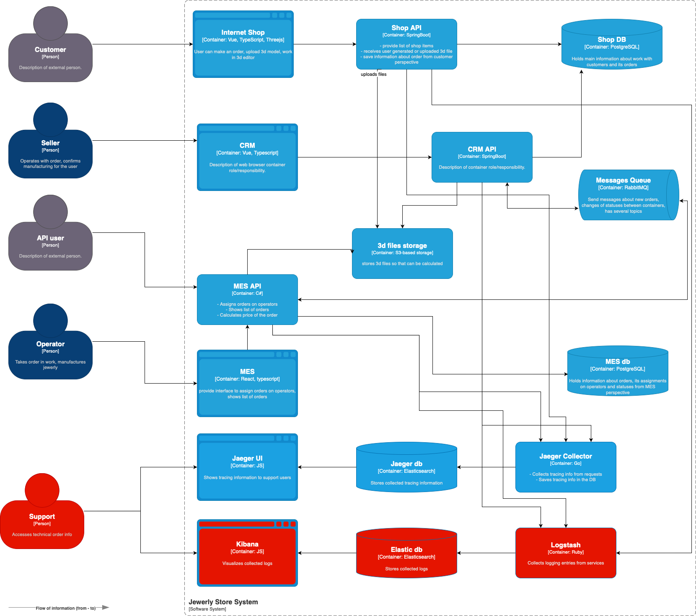

# Архитектурное решение по трейсингу

## Мотивация

Хранение и анализ логов сервисов позволит решать следующие задачи:

1. В случае ошибок проще будет анализировать ход обработки запросов по логам, а также искать, не было ли еще похожих проблем ранее, чтобы избежать траты ресурсов на повторное решение одинаковых проблем.
2. Разбивка логов по уровням и грамотное распределение этих уровней позволит целенаправленно находить самые критичные ошибки и приоретизировать их относительно менее критичных проблем. С другой стороны, всегда можно будет изменить уровень логирования и получить намого более детальную информацию при необходимости.
3. Логи станут дополнительным источником информации для мониторинга всех систем, и опираясь на анализ логов можно будет выявлять полезные для бизнеса закономерности и сигналы.

### Приоритетные сервисы для логирования

Так как команда не сможет внедрить логирование и трейсинг для всех сервисов, рекомендуется в первое время внедрить их для клиентских сервисов, а именно:

* Shop API
* CRM API
* MES API

Это позволит, в первую очередь, следить за выполнением всех запросов к системам компании и ко внешним сервисам (MES), а также к БД и очередям, и понимать, сколько занимает та или иная операция. Также это позволит находить ошибки в тех частях системы, которые проще всего поддаются исправлению, т.к. разработаны внутри компании.

Покрытие логами очередей сообщений, хранилища данных, БД нерационально, так как логи для них доступны по запросу (например, с помощью `pg_current_logfile` для PostgreSQL).

Покрыть MES в данном случае не представляется возможным, так как код ее закрыт для редактирования компанией. Максимум можно снимать системные логи, но на первом этапе это нецелесообразно, так как распылит внимание команды и не даст четкой картины происходящего в MES. Рекомендуется выяснить у разрабочика MES, не поддерживает ли она интеграцию с ELK из коробки?

## Предлагаемое решение

Предлагается реализовать сбор логов с помощью стека ELK - Elastic для хранения и поиска, Logstash для сбора и Kibana для визуализации логов. Это проверенный инструмент, позволяющий эффективно настраивать политики сбора логов и быстро выполнять поиск по ним благодаря индексам.

### Какие события требуется логировать с уровнем INFO?

| Сервис       | Событие                                                           |
|--------------|-------------------------------------------------------------------|
| **Shop API** | Создание нового заказа в БД                                       |
| **Shop API** | Добавление товара в корзину (заказ) в БД                          |
| **Shop API** | Получена на загрузку 3D-модель                                    |
| **Shop API** | 3D-модель успешно загружена в хранилище                           |
| **Shop API** | Заказ оформлен и данные об этом сохранены в БД и отправлены в CRM |
| **CRM API**  | Получена информация о новом заказе (из Shop DB)                   |
| **CRM API**  | Заказ подтвержден оператором                                      |
| **CRM API**  | Данные о заказе отправлены в MES (как сообщение в MQ)             |
| **CRM API**  | Данные о заказе получены из MES (как сообщение из MQ)             |
| **MES API**  | Получен новый заказ через внешнее API                             |
| **MES API**  | Данные о заказе сохранены в MES                                   |
| **MES API**  | Статус производства обновлен в MES                                |
| **MES API**  | Данные о заказе отправлены в CRM (как сообщение в MQ)             |
| **MES API**  | Данные о заказе получены из CRM (как сообщение из MQ)             |

### Политика доступа к логам

Как и в случае трассировки, при внедрении логов требуется учитывать ряд аспектов безопасности:

1. Должно быть настроено логирование не только сервисов, но и самого ELK-стека - т.к. доступ к логам может быть компрометирующим, то нужно видеть, кто и когда пытался получать доступ к логам
2. Доступ к логам должен быть разграничен между контурами, т.е. доступ к логам прода должен быть возможен только очень ограниченному кругу сотрудников
3. Конфиденциальные, персональные и другие чувствительные данные должны быть исключены из логов, причем настройка должна вестить в самих Logstash-агентах сотрудниками с максимальными привелегиями, чтобы не пускать процесс на откуп разработчиков и нижестоящих DevOps-инженеров
4. Доступ к логам через Kibana возможен только для сотрудников со следующими ролями:
   1. Ведущий DevOps, архитектор - доступ к логам и настройкам логирования, анонимизации логов и к логам доступа к самому ELK
   2. DevOps - доступ к логам и основным настройкам логирования
   3. Разработчики - доступ на чтение логов только для сервиса, к разработке которого они причастны
5. Требуется разработать и оттестировать план устранения проблемы на случай попадания в логи конфиденциальных данных. Такие данные должны сразу же удаляться при обнаружении. Процедуру следует для профилактики тестировать
6. Отправка логов между сервисами возможна только по защищенным каналам с помощью TLS, а доступ возможен только из корпоративной сети через VPN компании

### Хранение логов

Для эффективной работы с логами требуется также проработать политику их хранения.

#### Разделение логов на индексы

Предлагается разделить логи на индексы по трем ключам:

1. Название сервиса/компонента
2. Окружение
3. Дата

Например, индекс может быть назван `shop-api-prod-28-09-2025`.

Также потребуется добавить индекс для логов самого ELK, но доступ к нему должен быть максимально ограничен.

Таким образом получится достичь:

* Разграничения логов по сервисам и контурам (например, разработчик никогда не увидит логи с прода по чужому сервису)
* Управления временем хранения логов (логи dev и release должны храниться меньше, чем логи прода)
* В случае проблем с объемом логов проще выбирать, от каких логов избавляться в первую очередь

#### Время хранения логов

1. Логи test и release контуров можно хранить до недели, для анализа текущих проблем
2. Логи приложений на prod-контуре нужно хранить хотя бы 30 дней, для расследования более серьезных и повторяющихся инцидентов
3. Логи аудита ELK требуется хранить до 90 дней, с целью возможности проводить аудит безопасности доступа. Также сюда можно отдельно выделить в будущем все логи, связанные с доступом к системе (на первом этапе на это не хватит ресурсов)

Также для оптимизации объема логов требуется соблюдать следующие правила:

* На проде записываются логи только уровня `INFO` и более критичные, `DEBUG` можно включать только в случае критической необходимости
* Один индекс не должен привышать по размеру 50 Гб, иначе поиск с помощью Elasticsearch будет значительно более долгим

## Анализ логов

Для того, чтобы эффективнее работать с логами, требуется настроить алертинг в случае аномальной активности. Это повысит скорость реагирования на инциденты и снизит финансовые потери компании от них. Для алертинга с ELK можно выбрать инструмент ElastAlert, и задать в нем следующие правила для алертов:

1. Взлет количества логов с уровнем `ERROR` и `WARN` относительно нормального, в разрезе конкретного сервиса
2. Большое количество ошибок `HTTP 401` и `403` от API-сервисов, что говорит о попытках несанкционированного доступа
3. Частые ошибки при вызове S3/PostgreSQL/RabbitMQ/MES для обнаружения проблем с внешними сервисами
4. Ошибки `OutOfMemoryError` для API-сервисов, написанных на Java со Spring Boot