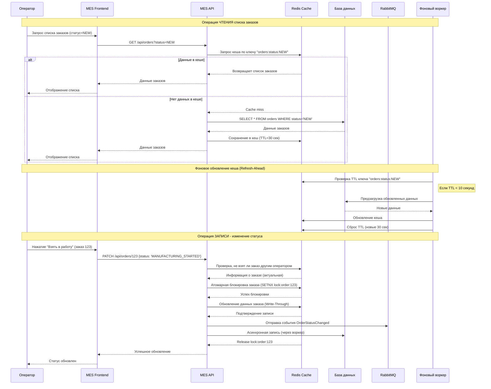

# Архитектурное решение по кешированию

## Мотивация

### Проблемы текущей системы:
1. Низкая скорость работы дашборда MES - операторы жалуются на долгую загрузку списка заказов
2. Высокая нагрузка на базу данных MES - частые запросы на чтение списков заказов с фильтрацией
3. Конкурентный доступ к заказам - операторы одновременно видят и пытаются брать одни и те же заказы
4. Задержки при расчете стоимости - синхронные запросы блокируют работу интерфейса

### Цели внедрения кеширования:
1. Ускорить отображение списка заказов для операторов
2. Снизить нагрузку на базу данных MES
3. Обеспечить актуальность данных о статусах заказов
4. Поддержать конкурентный доступ без блокировок

### Элементы системы для кеширования:
1. Списки заказов с фильтрацией по статусам - наиболее частый запрос
2. Данные отдельных заказов (кроме 3D-моделей)
3. Агрегированные данные для дашборда (количество заказов по статусам)

## Предлагаемое решение

### Тип кеширования: Серверное кеширование

Обоснование:
* Данные одинаковы для всех операторов (нет персонализации)
* Требуется централизованное управление инвалидацией кеша
* Необходима высокая скорость доступа и низкая задержка
* Клиентское кеширование не подходит из-за частых изменений статусов

Для выбора стратегии кэширования проведено сравнение возможных подходов:

| Подход        | Применимость                           | Комментарий                                                                                                                                                                         |
|---------------|----------------------------------------|-------------------------------------------------------------------------------------------------------------------------------------------------------------------------------------|
| Client-side   | Подходит, но для статического контента | Подходит для не меняющихся элементов интерфейса, но не подходит для списка заказов, так как пользователям (операторам) важно иметь максимально актуальные данные по статусам заказов |
| Cache-aside   | Подходит, но с низким TTL              | Наиболее легко оптимизирует чтения и с низким TTL (до 30 секунд) позволяет возвращать корректные данные                                                                             |
| Read-through  | Не подходит                            | Не подходит, так как есть высокий риск несогласованности данных по заказам                                                                                                          |
| Refresh-ahead | Не подходит                            | Возможна несогласованность при ошибках в данных                                                                                                                                     |
| Write-through | Подходит для операций записи           | Строго согласованные данные по заказам, подходит для оптимизации операций обновления статуса                                                                                        |
| Write-ahead   | Не подходит                            | Данные могут оказаться несогласованными в случае ошибок записи в БД                                                                                                                 |

### Паттерн кеширования: Write-Through + Refresh-Ahead (комбинированный)

#### Write-Through для операций записи:
1. При изменении статуса заказа:
* Сначала обновление в кеше (Redis)
* Затем асинхронная запись в базу данных
* Отправка события в RabbitMQ для других систем

2. Преимущества Write-Through:
* Данные в кеше всегда актуальны
* Консистентность между кешем и БД
* Меньше риска потери данных при сбоях
* Операторы видят изменения статусов сразу

#### Refresh-Ahead для чтения популярных данных:
1. Для часто запрашиваемых списков заказов:
* Автоматическое обновление кеша до истечения TTL
* Фоновая подгрузка данных
* Минимизация cache miss

2. Cache-Aside не подходит, потому что:
* При частых изменениях статусов приводит к постоянным cache miss
* Не гарантирует актуальность данных для конкурентного доступа
* Требует сложной логики инвалидации
* Не решает проблему высокой нагрузки на БД при частых чтениях

### Диаграмма последовательности операций



### Инвалидация кэша

#### Основная стратегия: **Программная инвалидация по событиям + TTL**

1. **По ключам на основе событий:**
   - При изменении статуса заказа → инвалидация списков по старому и новому статусу
   - При создании нового заказа → инвалидация списка "NEW"
   - При изменении данных оператора → инвалидация агрегированных данных

2. **TTL (Time-To-Live) как fallback:**
   - Основные данные: 5 минут
   - Списки заказов: 30 секунд (для операторов)
   - Блокировки: 10 секунд

3. **Почему другие стратегии не подходят:**
   - **Только временная (TTL)**: недостаточно для конкурентного доступа, данные могут быть устаревшими
   - **Только по ключу**: сложно отслеживать все зависимости между данными
   - **Write-Back**: риск потери данных при сбое кеша
   - **Write-Around**: приводит к частым cache miss

#### Реализация инвалидации:

```plaintext
Ключи кеша:
1. orders:status:{status}:page:{page} - списки заказов
2. order:{id} - данные конкретного заказа
3. dashboard:stats - агрегированные данные
4. lock:order:{id} - блокировки для конкурентного доступа

При изменении статуса заказа {id} со статуса OLD на NEW:
1. Удалить ключи:
   - orders:status:OLD:page:*
   - orders:status:NEW:page:*
2. Обновить ключ order:{id}
3. Инвалидировать dashboard:stats
```

## Сравнительный анализ стратегий кеширования

### Таблица сравнения паттернов:

| Критерий | Cache-Aside | Write-Through | Write-Back | Refresh-Ahead |
|----------|-------------|---------------|------------|---------------|
| **Актуальность данных** | Низкая (данные могут устаревать) | Высокая (данные всегда свежие) | Средняя (данные обновляются периодически) | Высокая (предзагрузка обновлений) |
| **Производительность записи** | Высокая (только в БД) | Средняя (кеш + БД) | Высокая (только в кеш) | Средняя (кеш + БД) |
| **Производительность чтения** | Средняя (cache miss дорогие) | Высокая (данные в кеше) | Высокая (данные в кеше) | Очень высокая (минимальные cache miss) |
| **Консистентность** | Слабая | Сильная | Слабая (риск потери данных) | Сильная |
| **Сложность реализации** | Низкая | Средняя | Высокая | Высокая |
| **Подходит для MES** | ❌ Не подходит | ✅ Оптимально | ❌ Рискованно | ✅ Дополнительно |

### Таблица сравнения решений:

| | **Решение 1: Write-Through + Refresh-Ahead** | **Решение 2: Cache-Aside + Write-Behind** |
|----------------|-----------------------------------------------|------------------------------------------|
| **Описание** | Все операции записи идут через кеш. Данные всегда актуальны. Refresh-Ahead предотвращает cache miss. | Данные загружаются в кеш при запросе. Записи сначала в кеш, затем асинхронно в БД. |
| **Диаграмма** | См. выше | Аналогична, но без предзагрузки и с другим порядком записи |
| **Плюсы** | 1. Максимальная актуальность данных<br>2. Минимальные задержки чтения<br>3. Конкурентный доступ безопасен<br>4. Низкая нагрузка на БД | 1. Проще в реализации<br>2. Высокая производительность записи<br>3. Устойчивость к сбоям БД |
| **Минусы** | 1. Сложнее реализация<br>2. Требует больше ресурсов Redis<br>3. Нужен фоновый воркер | 1. Риск потери актуальности данных<br>2. Cache miss замедляют работу<br>3. Сложнее конкурентный контроль |

## Заключение

### Рекомендуемое решение: **Write-Through + Refresh-Ahead**

**Обоснование выбора:**

1. **Для MES критична актуальность данных** - операторы должны видеть реальное состояние заказов, чтобы избежать конфликтов при работе.

2. **Конкурентный доступ требует атомарных операций** - Write-Through позволяет реализовать безопасные блокировки через Redis.

3. **Высокая частота чтения** - Refresh-Ahead минимизирует cache miss для часто запрашиваемых списков заказов.

4. **Интеграция с асинхронными процессами** - паттерн хорошо сочетается с существующей очередью RabbitMQ.

5. **Соответствие бизнес-процессам**:
   - Изменение статуса может занимать время (оператор работает над заказом)
   - Главное - обеспечить чтение из кеша при проверке, не был ли заказ передан другому оператору
   - После изменения статуса данные отправляются в очередь для других систем (CRM, магазин)

### План внедрения:
1. **Этап 1**: Внедрение Redis для кеширования отдельных заказов (Write-Through)
2. **Этап 2**: Кеширование списков заказов с фильтрами
3. **Этап 3**: Реализация Refresh-Ahead для популярных запросов
4. **Этап 4**: Интеграция блокировок для конкурентного доступа

### Ожидаемые результаты:
- Ускорение загрузки дашборда MES в 5-10 раз
- Снижение нагрузки на БД MES на 70-80%
- Устранение конфликтов при одновременном взятии заказов
- Улучшение пользовательского опыта операторов

### Примеры операции с кэшированием

#### Чтение списка заказов

[Диаграмма последовательностей](get_orders.puml)

#### Обновление статуса заказа

[Диаграмма последовательностей](update_status.puml)
